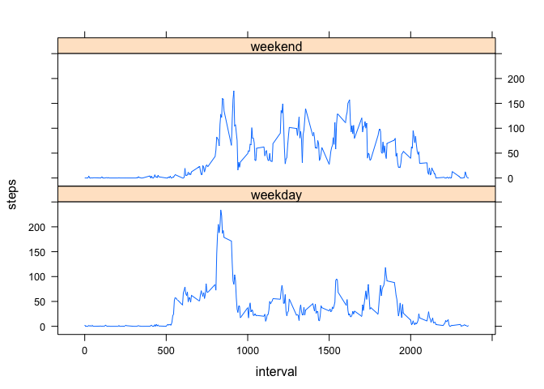

# Reproducible Research: Peer Assessment 1


## Loading and preprocessing the data

```r
setwd('/Users/Coursera/Reproducable Research')
data<-read.table('activity.csv', sep=",", head=T)
data$date<-as.Date(data$date, '%Y-%m-%d')
```

## What is mean total number of steps taken per day?

```r
#Daily step total
dst<-aggregate(steps ~ date, data, sum)
hist(dst$steps, xlab='Daily Step Total', main='Histogram of Daily Step Total')
```

 

```r
mean(dst$steps)   # mean total number of steps taken per day:
```

```
## [1] 10766.19
```

```r
median(dst$steps) # median total number of steps taken per day
```

```
## [1] 10765
```


## What is the average daily activity pattern?

```r
#hourly averaged steps
has<-aggregate(steps ~ interval, data, mean)
plot.ts(has$interval, has$steps, type='l', xlab='Interval', ylab='Average across all the days')
```

 

```r
# interval with max steps
has$interval[which(has$steps==max(has$steps))]
```

```
## [1] 835
```
## Imputing missing values

```r
#no of rows with na
nrow(data[apply(is.na(data), 1, any), ])
```

```
## [1] 2304
```

```r
#strategy average of the interval steps for each day
q3<-aggregate(data$steps~date+interval, data, mean, na.rm=FALSE)

#fill na steps with the average
na_ind = which(is.na(data$steps), arr.ind=TRUE)
steps_mean = mean(q3$`data$steps`)
data_filled <- data
for (i in 1:length(na_ind)) {
  steps <- q3[q3$date== data[i, c('date')] & q3$interval == data[i, c('interval')] ,c('data$steps')]
  if(length(steps) > 0) {
    data_filled[i, c('steps')] <- steps
  }else {
    data_filled[i, c('steps')] <- steps_mean
  }
}

# plot
dstq3<-aggregate(steps ~ date, data_filled, sum)
par(mfrow=c(1,2))
hist(dst$steps, xlab='Daily Step Total', main='Histogram of Daily Step Total(With NA)')
hist(dstq3$steps, xlab='Daily Step Total', main='Histogram of Daily Step Total(Without NA)')
```

 

```r
# steps mean without NA
mean(dstq3$steps)  
```

```
## [1] 10766.19
```

```r
# steps mean with NA
mean(dst$steps)
```

```
## [1] 10766.19
```

```r
#steps median without NA
median(dstq3$steps)
```

```
## [1] 10766.19
```

```r
#steps median with NA
median(dst$steps)   
```

```
## [1] 10765
```

## Are there differences in activity patterns between weekdays and weekends?

```r
weektype <- c('weekday','weekend')
weekday <- c("Monday", "Tuesday", "Wednesday", "Thursday", "Friday")
weekend <- c("Saturday", "Sunday")
data$weektype <- weektype[as.numeric(weekdays(data$date) %in% weekend)+1]
weekday_weekend_avg_steps<-aggregate(steps ~ weektype + interval, data, mean)

library(lattice) 
xyplot(steps ~ interval | weektype, data = weekday_weekend_avg_steps, type = "l", layout=c(1,2))
```

 
